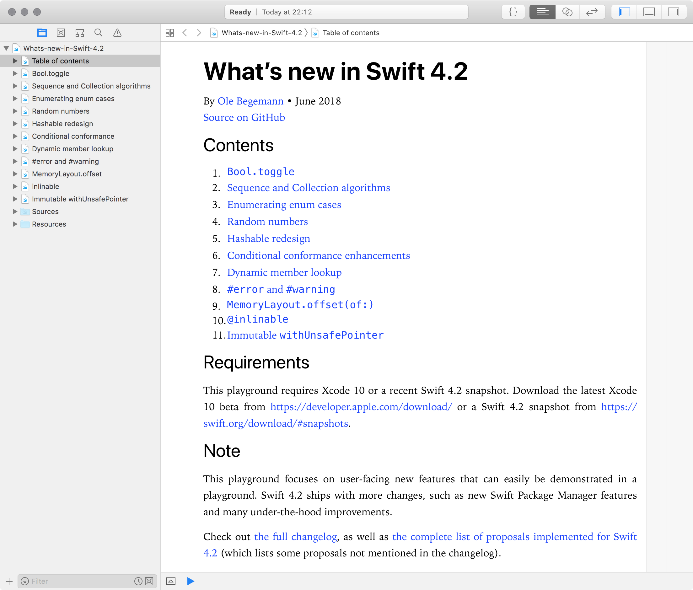

# What’s new in Swift 4.2

An Xcode playground demonstrating the new features in Swift 4.2.

Written by [Ole Begemann](https://oleb.net), June–September 2018.

The playground requires Swift 4.2, which is part of Xcode 10.

See also: my [What’s new in Swift 4.0 playground](https://github.com/ole/whats-new-in-swift-4) from 2017.

